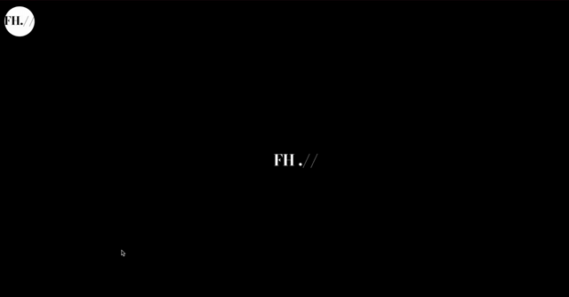

# FitHub

## Description

This project was created to provide the user with an application to display their fashion sense. Users will be able to put together outfits, save them to their account, and display them to other users.

## Table of Contents

1. [Description](#description)

2. [Installation](#installation)

3. [Usage](#usage)

4. [Credits](#credits)

5. [License](#license)

6. [Questions](#questions)

## Usage

Navigate to this [website](https://morning-ravine-18715-2df03199dbf8.herokuapp.com/).

First time users must sign up with a username, email, and password by pressing the "sign-up" button in the top-left corner of the landing page. Returning users will be able to log in. Users can create new outfits in the "Create" tab. Then their saved outfits will be displayed in the "Yours" tab of the nav bar. Any of these outfits can be selected by clicking on the image, allowing user to update and delete each outfit. The "Top" tab of the nav bar will display all users' saved outfits ordered by most liked. Any of these can be selected by clicking on the image, allowing the logged in user to like the outfit.

## Credits

This website was created by [Brian Pizzimenti](https://github.com/BrianPizz), [Jamie Han](https://github.com/jamu-bu/), [Christopher King](https://github.com/theekidspex), and [Justin Chun](https://github.com/jnc444xd).

## License

This project is covered under the [MIT License](https://choosealicense.com/licenses/mit/).

## Questions

For any additional questions, please refer to the project's [GitHub page](https://github.com/BrianPizz/fithub).
